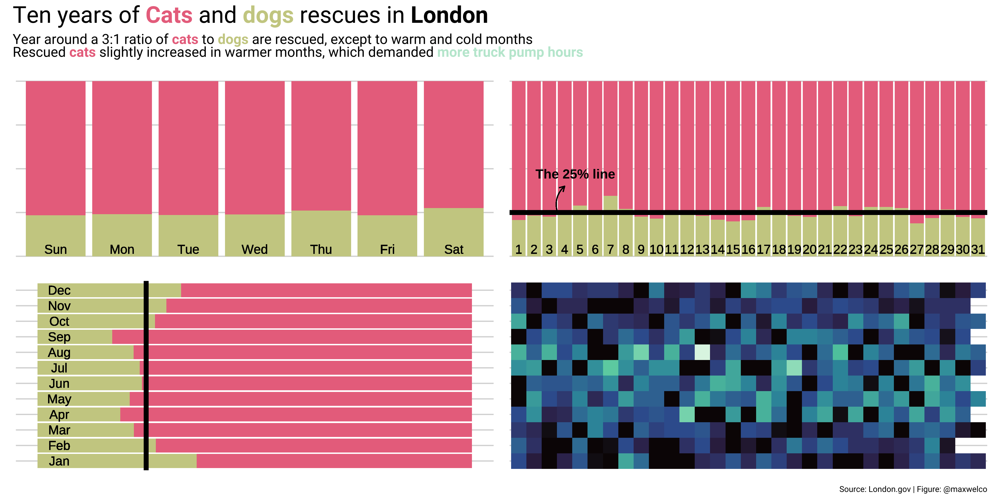
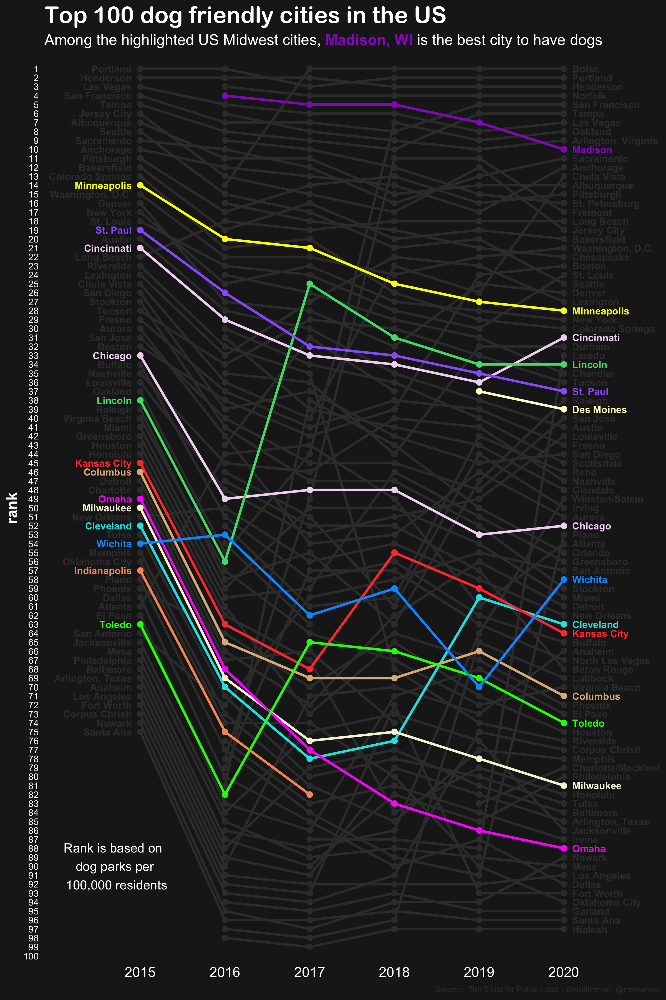
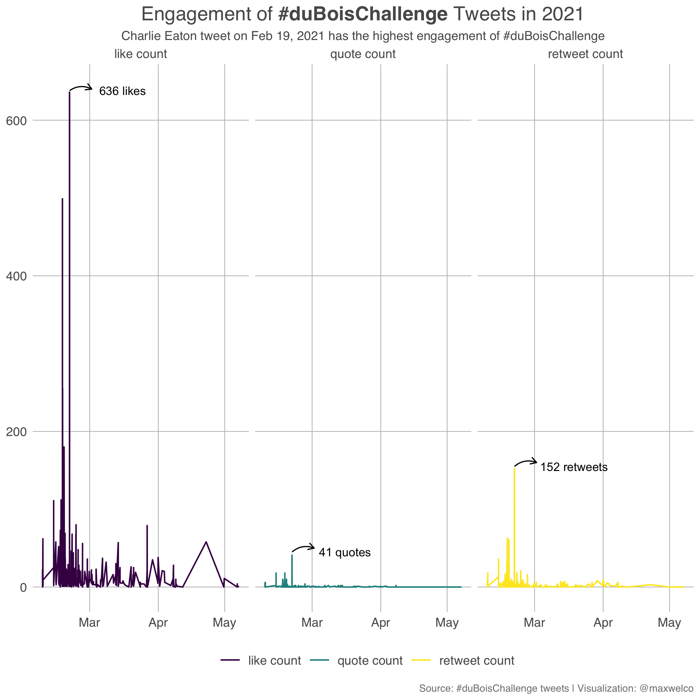
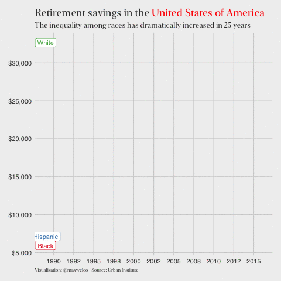

# Tidy-Tuesday

My participation on [#TidyTuesday challenge](https://github.com/rfordatascience/tidytuesday)

## 2021

### Week 27 - Aniaml rescue

### Week 26 - Dog parks

### Week 25 - duBois tweets

 

### Week 24 - Fishing

 

### Week 23 - Survivor

 

### Week 22 - Mario kart

 

### Week 21 - Annual salary

 

### Week 20 - Broadband inequality

### Week 19 - Water Sources in Peru

### Week 19 - CEO Departures

### Week 17 - Netflix

### Week 13 - Votes UN

### Week 13 - Wealth

### Week 04 - Kenya

## 2020

### Week 40 - Beyonce

### Week 39 - Himalayan Climbing Expedition

### Week 38 - Investment

