# Tidy-Tuesday

My participation on [#TidyTuesday challenge](https://github.com/rfordatascience/tidytuesday)

## 2022

### Week 18 - Megawatt hour cost (US$) of <b style='color:#56B4E9;'>wind</b>, <b style='color:#E69F00;'>solar</b>, <b style='color:#000000;'>gas</b> energy in the US

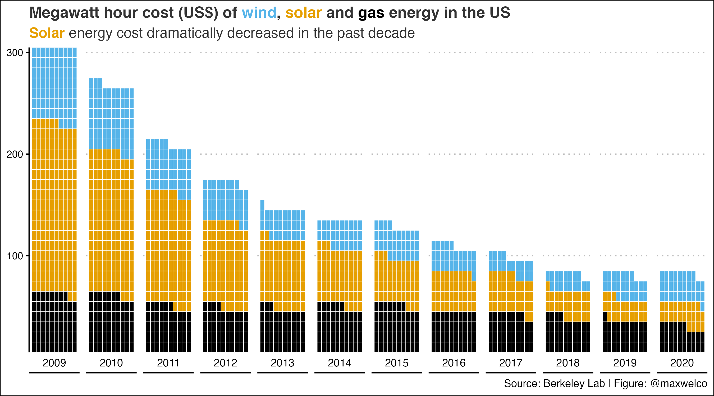

## 2021

### Week 52 - Starbucks drinks

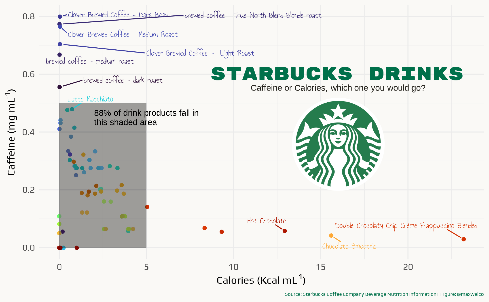

### Week 46 - Learning with afrilearndata

### Week 45 - Map - Herbicide Weed Resistance

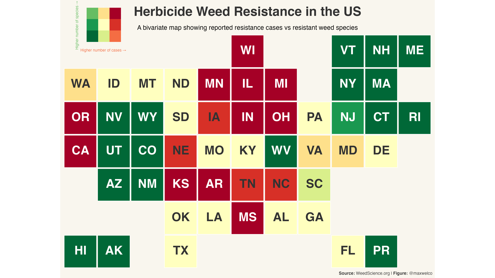

### Week 44 - Ultra Marathon Running

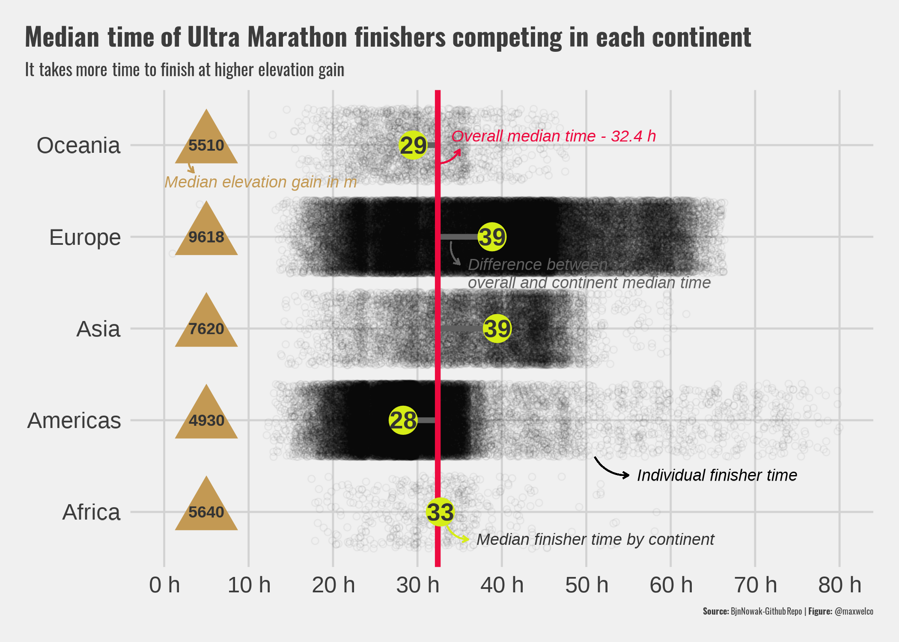

### Week 43 - Pumpkins

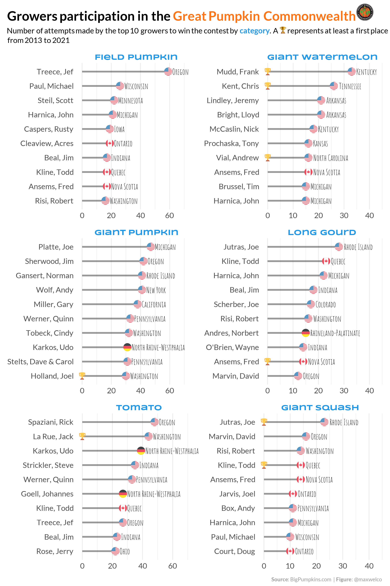

### Week 42 - Global Seafood

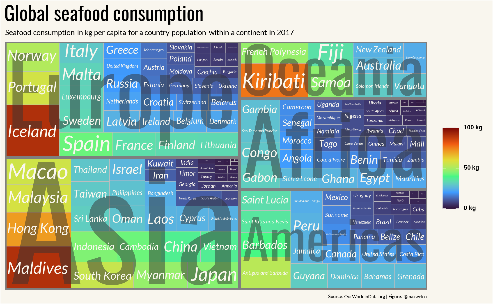

### Week 41 - Nurses wages

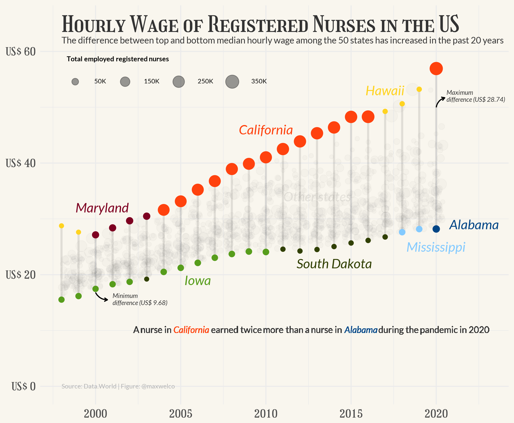

### Week 40 - NBER

### Week 39 - Emmy Awards

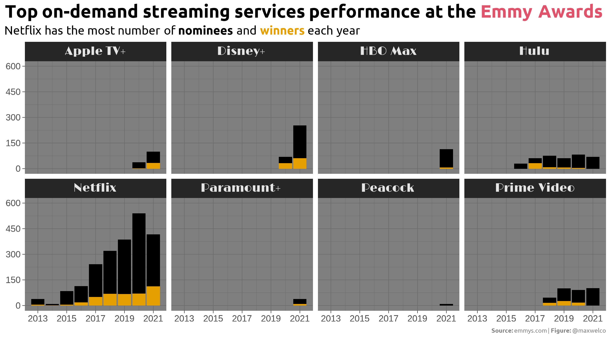

### Week 38 - Billboard

### Week 37 - F1 races

### Week 36 - Birds

### Week 35 - Lemurs

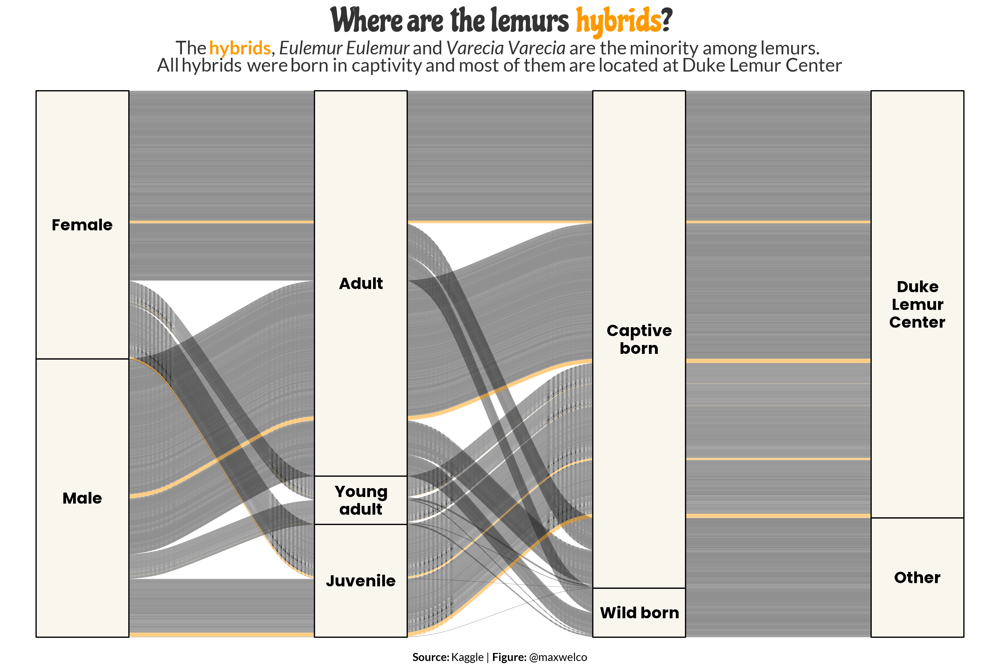

### Week 34 - Star Trek

### Week 33 - Infrastructure investments

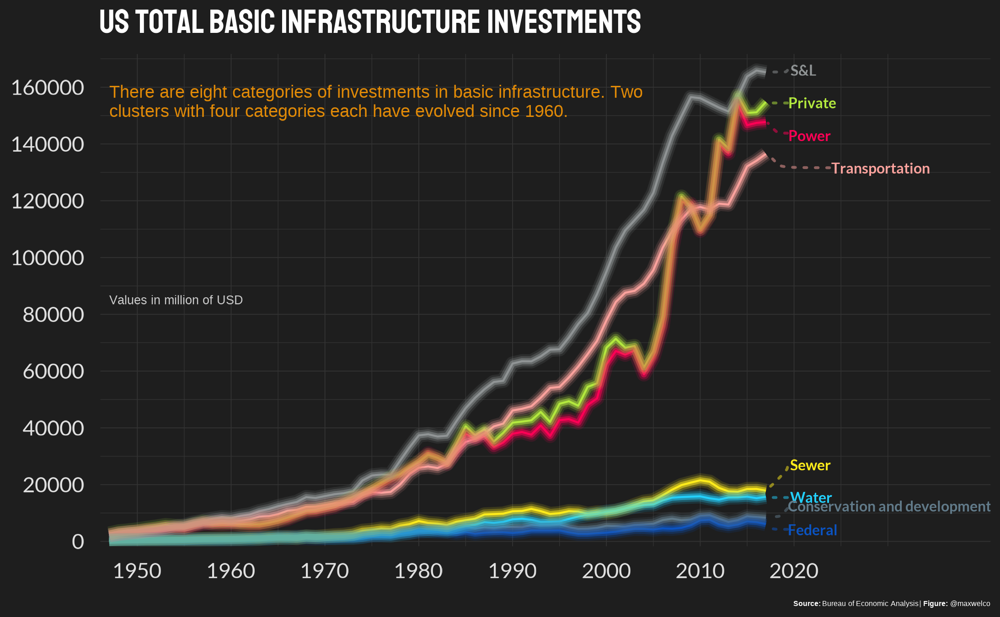

### Week 32 - Paralympics

### Week 31 - Olympics

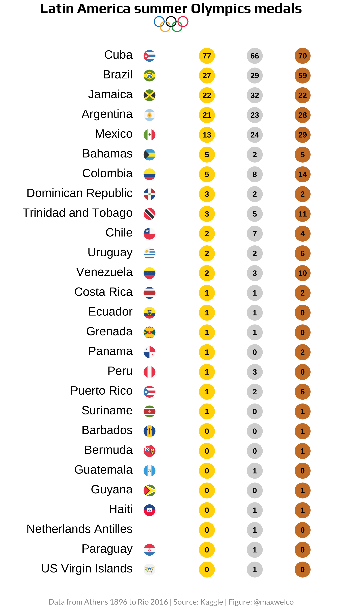

### Week 30 - US drought

### Week 29 - Scooby-Doo Episodes

### Week 28 - Independence

### Week 27 - Animal rescue

### Week 26 - Dog parks

### Week 25 - duBois tweets

 

### Week 24 - Fishing

 

### Week 23 - Survivor

 

### Week 22 - Mario kart

 

### Week 21 - Annual salary

 

### Week 20 - Broadband inequality

### Week 19 - Water Sources in Peru

### Week 18 - CEO Departures

### Week 17 - Netflix

### Week 15 - Deforestation

### Week 13 - Votes UN

### Week 7 - Wealth

### Week 04 - Kenya

## 2020

### Week 40 - Beyonce

### Week 39 - Himalayan Climbing Expedition

### Week 38 - Investment

